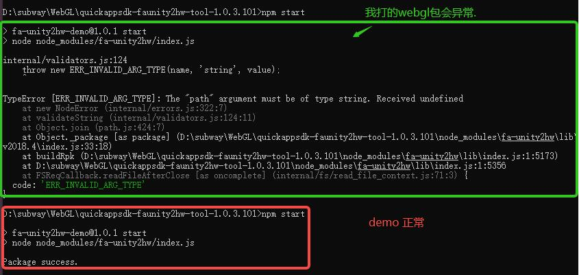

# FAQ<a name="ZH-CN_TOPIC_0000001480836426"></a>

-   [如何处理依赖文件安装失败](#section144922623620)
-   [执行npm打包快游戏时报错](#section117651448143620)
-   [Unity转RPK快游戏包体过大](#section1812814107377)
-   [运行RPK包报错AbortController is not defined](#section1349532810374)
-   [运行快游戏RPK时黑屏](#section1396074113370)
-   [Unity帧率问题](#section1365215152016)

## 如何处理依赖文件安装失败<a name="section144922623620"></a>

-   问题原因

    可能因为网络的问题无法下载并安装**默认地址**的依赖文件。

-   解决方案
    1.  在打包工具的根目录下进入终端界面，输入命令设置npm国内镜像地址。

        ```
        npm config set registry https://repo.huaweicloud.com/repository/npm/
        npm cache clean -f
        ```

    2.  输入命令安装依赖文件。

        ```
        npm install
        ```


## 执行npm打包快游戏时报错<a name="section117651448143620"></a>

-   问题描述

    已确保打包之前所有的操作项、配置项正确无误后，执行npm start命令行打包从Unity导出的WebGL项目时报错，而打包官方提供的正式Demo则会成功。

    


-   问题原因

    对于想要转换成快游戏的Unity游戏来说，我们会区分Unity版本号，建议在2018.3、2018.4、2019.2、2019.4、2020.3开头的Unity版本中导出WebGL项目，并且推荐使用2020.3版本。使用未支持的Unity版本打包快游戏，可能因为无法识别部分参数而导致打包失败。


-   解决方案
    -   重新安装可支持的Unity版本，再根据流程打包成RPK包体。
    -   上述报错需将WebGL项目本地目录Build/output\_WebGL.json中asmFrameworkUrl参数改为wasmFrameworkUrl就可以打包成功了。


## Unity转RPK快游戏包体过大<a name="section1812814107377"></a>

-   问题描述

    最终打包的快游戏RPK包体超过规定的20MB。


-   解决办法

    对于Unity发布的游戏体积过大，我们需要处理Unity游戏本身的打包过程。

    1.  对Unity游戏进行[分包处理](https://docs.unity3d.com/cn/2020.3/Manual/AssetBundles-Workflow.html)。
    2.  将Unity游戏项目发布成WebGL项目。原Unity项目中AssetBundle文件保存WebGL项目的StreamingAssets文件夹下。
    3.  把StreamingAssets文件夹中的所有内容放到自己服务器上。
    4.  打包快游戏RPK前，配置打包工具根目录下**config.json**中**addressable\_asset\_system\_streaming\_assets\_url**为您的服务器地址。打包后的RPK包体缩小不少，成功把分包中的资源放到远程服务器上请求了。

    经过上述处理后，打包的RPK包体仍然超出规定的20MB，后续还可以考虑压缩、优化、重构源代码。


## 运行RPK包报错AbortController is not defined<a name="section1349532810374"></a>

-   问题描述

    Unity游戏项目成功转换成快游戏后，运行时提示**AbortController is not defined**错误。

-   问题原因

    对于Unity发布的游戏来说，我们是区分不同Unity版本的。对于Unity2021.3版本我们是有限支持的，在Unity2021.3版本上发布打包成快游戏后，确实报**AbortController is not defined**错误。当前我们支持2018.3、2018.4、2019.2、2019.4、2020.3开头的Unity版本，推荐2020.3开头的Unity版本。若发现游戏性能无法满足需求，推荐版本2021.3.11f1c2，其它2021开头的版本可能不能直接转换。

-   ****解决方案

    重新安装可支持的Unity版本，再根据流程打包成RPK包体。


## 运行快游戏RPK时黑屏<a name="section1396074113370"></a>

-   问题描述

    Unity游戏项目成功转换成快游戏后，运行时**黑屏**。

-   解决方案

    在已支持的Unity版本上导出WegGL项目，需严格按照[发布WebGL项目](第二步-发布WebGL项目.md)、[打包快游戏](第三步-打包快游戏.md)发布打包，否则会导致不兼容等一系列错误。


## Unity帧率问题<a name="section1365215152016"></a>

建议不要使用Unity中的帧率设置。

