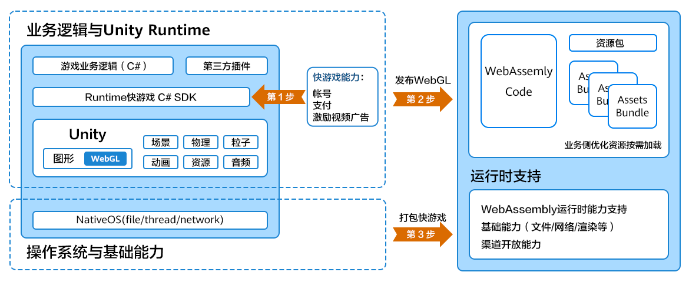

# Unity WebGL快游戏适配方案

-   [业务简介](#section15199104714389)
-   [主要优势](#section1221810561334)
-   [工作原理](#section19868189193414)
-   [转换案例](#section19703164714290)
-   [准备工作](#section1081804723120)
    -   [AppGallery Connect控制台准备](#section1245866121711)
    -   [工具准备](#section10468162781718)
    -   [素材准备](#section162721931181311)

-   [第一步：接入快游戏能力](#section3445102643414)
-   [第二步：发布WebGL项目](#section863116373348)
-   [第三步：打包快游戏](#section8311205093420)
-   [调试与上架](#section6455222143620)
    -   [本地调试](#section23801612224)
    -   [发布上架](#section20355777264)

## 业务简介

欢迎使用Unity游戏转快游戏的转换方案，本方案设计的目的是降低游戏转换的开发成本，即您无需更换Unity引擎、无需重写核心代码的情况下将原有的Unity游戏项目转换为快游戏。

## 主要优势

-   对比H5快游戏方案，性能有明显提升。
-   无需重写核心代码，降低转换成本。
-   转换工具支持打包快游戏RPK包。

## 工作原理

Unity游戏是使用C\#语言开发的游戏，而快游戏的运行环境却是使用V8引擎和JS Framework解析执行。从c\#到js，我们采用的方案是使用WebGL作为桥梁进行跨端合并。

-   Unity游戏提供了发布成WebGL项目的能力，详情见[Unity官网介绍](https://docs.unity3d.com/cn/2020.3/Manual/webgl-technical-overview.html)。
-   快游戏引擎采用了WebGL1.0规范，使用adapter层模拟实现了Unity游戏发布WebGL项目后所依赖的WEB API。
-   使用WebGL配置方案，将Unity游戏原生WebGL项目打包成快游戏。

## 转换案例

更多案例可参考[成功案例](成功案例.md)。

<table id="simpletable17169195151016"><tr id="strow2017045113106"><td valign="top" id="stentry1129313357139">
地铁跑酷

</td>
<td valign="top" id="stentry1317020517103">
百变化妆大师

</td>
<td valign="top" id="stentry9170195115106">
合合美美

</td>
<td valign="top" id="stentry1417055114107">
装扮小屋

</td>
</tr>
<tr id="strow17170205118104"><td valign="top" id="stentry929393516134">
游戏主线从三条铁轨上展开，玩家要以孩子Jake的身份不断在铁轨中穿梭来躲避列车，同时收集金币，躲避警察及猎狗的追捕。

</td>
<td valign="top" id="stentry6170195171014">
一款以化妆为背景的模拟体验游戏，系统会根据玩家的选择与场景的适配性为玩家打分，让每个玩家都能描绘出属于自己的靓丽美貌。

</td>
<td valign="top" id="stentry17170135117107">
一款简单的合成消除游戏，融合经营、消除、合成元素，在现有的棋盘上，找到相同的物品，拖拽合并，便可轻松完成搭配收集的任务，简单易上手的操作。

</td>
<td valign="top" id="stentry12170155118102">
一款模拟装修的游戏，玩家在里面可以对房屋进行装扮，完成任务获得更多的家具，能够自由地摆放家具,按照自己的喜好装扮不同风格的小屋。

</td>
</tr>
<tr id="strow1817012515108"><td valign="top" id="stentry102931635151310">

</td>
<td valign="top" id="stentry81701951181010">

</td>
<td valign="top" id="stentry417012513103">

</td>
<td valign="top" id="stentry4170951131016">

</td>
</tr>
</table>

## 准备工作

### AppGallery Connect控制台准备

-   在开发者联盟官网[注册开发者帐号](https://developer.huawei.com/consumer/cn/doc/start/registration-and-verification-0000001053628148)，并[实名认证](https://developer.huawei.com/consumer/cn/doc/start/ht-edrna-0000001154848578)。
-   在AppGallery Connect控制台[创建项目](https://developer.huawei.com/consumer/cn/doc/distribution/app/agc-help-createproject-0000001100334664)并[在项目下添加快游戏](https://developer.huawei.com/consumer/cn/doc/distribution/app/agc-help-createapp-0000001146718717#section15155122514817)。
-   上架快游戏必须接入华为帐号登录能力，您在AppGallery Connect控制台需[打开游戏服务API开关](https://developer.huawei.com/consumer/cn/doc/development/quickApp-Guides/quickgame-enable-game-kit-0000001113292730#section1724214523574)与[打开华为帐号API开关](https://developer.huawei.com/consumer/cn/doc/development/quickApp-Guides/quickgame-enable-account-kit-0000001159772367#section1468372716348)。**其它API开关**请根据接入的快游戏能力进行配置。

### 工具准备

-   下载**C\# SDK**包。
-   前往[Unity官网](https://unity.cn/releases/lts/2021)下载并安装Unity IDE。用于转换快游戏的Unity IDE版本号支持如下：

    
    <table><tbody><tr id="row575874144915"><th class="firstcol" valign="top" width="13.36%" id="mcps1.1.3.1.1">
推荐Unity版本

    </th>
    <td class="cellrowborder" valign="top" width="86.64%" headers="mcps1.1.3.1.1 ">
2020.3开头的版本。

    </td>
    </tr>
    <tr id="row9758204114911"><th class="firstcol" valign="top" width="13.36%" id="mcps1.1.3.2.1">
已支持Unity版本

    </th>
    <td class="cellrowborder" valign="top" width="86.64%" headers="mcps1.1.3.2.1 ">
2018.3、2018.4、2019.2、2019.4、2020.3、2021.3开头的版本。若发现游戏性能无法满足需求，可以尝试使用2021版本，2021开头的版本受限支持，推荐版本<strong id="b17821452182015">2021.3.11f1c2</strong>，其它2021开头的版本可能不能直接转换。

    </td>
    </tr>
    </tbody>
    </table>

-   准备Android 6.0及以上版本的手机/平板设备，要求：
    -   设备已[安装快应用加载器](https://developer.huawei.com/consumer/cn/doc/development/quickApp-Guides/quickgame-installtool-0000001166035569#section20867195051318)。
    -   设备已成功连接电脑，详细操作可参考[手机如何成功连接电脑](https://developer.huawei.com/consumer/cn/doc/development/quickApp-Guides/quickgame-developer-mode-0000001634026457)。

-   若打包快游戏使用[本地打包方式](第三步-打包快游戏.md#section089016114271)，您需下载**adapter**文件夹、**tools**文件夹，同时前往[node官网](https://nodejs.org/en/download)下载并安装node.js，且npm版本大于9.6.1。若打包快游戏使用[客户端打包方式](第三步-打包快游戏.md#section1973035142715)，您需下载并安装最新的[快游戏开发者工具](https://developer.huawei.com/consumer/cn/doc/development/quickApp-Guides/quickgame-releasenotes-dev-tool-0000001619298089)。

### 素材准备

<table><thead align="left"><tr id="row1479413418131"><th class="cellrowborder" valign="top" width="30%" id="mcps1.1.3.1.1">
准备项

</th>
<th class="cellrowborder" valign="top" width="70%" id="mcps1.1.3.1.2">
要求

</th>
</tr>
</thead>
<tbody><tr id="row198981414162"><td class="cellrowborder" valign="top" width="30%" headers="mcps1.1.3.1.1 ">
签名文件

</td>
<td class="cellrowborder" valign="top" width="70%" headers="mcps1.1.3.1.2 ">
操作详情可参见<a href="https://developer.huawei.com/consumer/cn/doc/development/quickApp-Guides/quickgame-generate-fingerprint-0000001113452452#section15374115218356" target="_blank" rel="noopener noreferrer">生成证书、密钥文件</a>。

</td>
</tr>
<tr id="row1258024221613"><td class="cellrowborder" valign="top" width="30%" headers="mcps1.1.3.1.1 ">
快游戏图标

</td>
<td class="cellrowborder" valign="top" width="70%" headers="mcps1.1.3.1.2 "><ul id="ul1175435212141"><li>分辨率216*216px，不超过2MB的PNG图片。</li><li>图标圆角大小为0。</li></ul>
</td>
</tr>
</tbody>
</table>

## 第一步：接入快游戏能力

快游戏必须接入**华为帐号登录**能力，其它的快游戏能力按需接入，但Unity游戏项目使用C\#开发语言，快游戏使用JS开发语言，C\#不能直接调JS接口，因此需封装JS接口给C\#调用。为了节省您的开发时间，直接使用**C\# SDK**，您仅需在Unity IDE中导入SDK包后，直接调用对应的接口即可快速[接入快游戏能力](第一步-接入快游戏能力.md)。目前，该SDK可以实现华为帐号登录、商品支付、激励视频广告播放能力，若想实现更多能力，您可以参考**Demo**封装、调用JS接口。

## 第二步：发布WebGL项目

快游戏引擎采用了WebGL1.0规范，您需在Unity IDE中将游戏项目[发布WebGL项目](第二步-发布WebGL项目.md)。

## 第三步：打包快游戏

WebGL项目需使用WebGL配置方案[打包快游戏](第三步-打包快游戏.md)；或直接在快游戏开发者工具中将WebGL项目转换成快游戏。

## 调试与上架

### 本地调试

为了保证转换后的快游戏有更好的软件性能与用户体验，您需在**快应用加载器**运行/调试游戏。您可以根据接入的快游戏服务逐一进行功能测试，详情可参考[快游戏开发指南手册](https://developer.huawei.com/consumer/cn/doc/development/quickApp-Guides/quickgame-dev-runtimegame-guide-0000001159778255)。

### 发布上架

前往AppGallery Connect控制台上架转换后的快游戏。

1.  在AppGallery Connect控制台[配置快游戏的基本信息](https://developer.huawei.com/consumer/cn/doc/distribution/app/agc-help-configure-appinfo-0000001100086630)。
2.  在AppGallery Connect控制台[发布快游戏](https://developer.huawei.com/consumer/cn/doc/distribution/app/agc-help--release-fastapp-0000001099836868)。
3.  提交上架申请后，请耐心等待审核。

