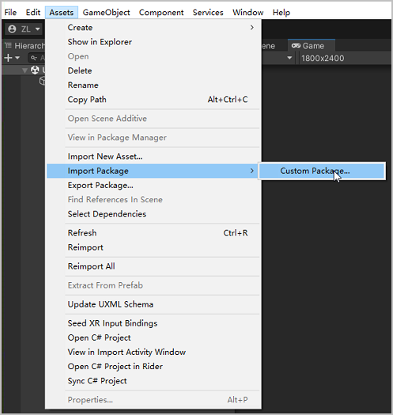
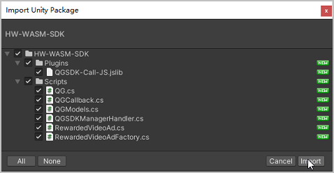
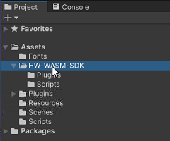
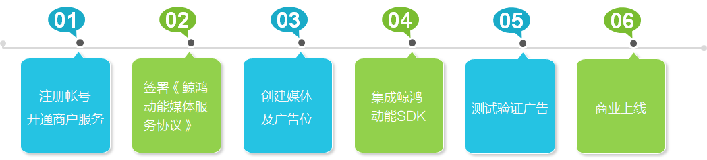

# 第一步：接入快游戏能力<a name="ZH-CN_TOPIC_0000001475697493"></a>

-   [导入SDK](#section156327187381)
-   [接入帐号能力](#section41611482350)
    -   [业务简介](#section333814580155)
    -   [前提条件](#section4732611491)
    -   [开发步骤](#section1938775716199)

-   [接入支付能力-消耗型商品](#section152318521719)
    -   [业务简介](#section1674111963413)
    -   [前提条件](#section93091249121715)
    -   [开发步骤](#section1618725016131)
    -   [示例代码](#section376219526517)

-   [接入支付能力-非消耗型商品](#section16498149114213)
    -   [业务简介](#section149561123184211)
    -   [前提条件](#section1365411516321)
    -   [开发步骤](#section57231857114213)
    -   [示例代码](#section145889338452)

-   [接入激励视频广告能力](#section166666149234)
    -   [业务简介](#section5582183481517)
    -   [前提条件](#section14539172516344)
    -   [开发步骤](#section18411732163410)
    -   [示例代码](#section184233551572)


## 导入SDK<a name="section156327187381"></a>

在Unity IDE中导入SDK包后，直接调用对应的接口即可快速接入对应的快游戏能力。目前，SDK可以接入华为帐号登录、商品支付、激励视频广告播放等能力。若想实现更多能力，您可以参考**demo**文件夹的demo封装并调用JS接口。

> **说明：** 
>C\# SDK的API接口介绍请参见[C\# SDK API参考](C-SDK-API参考.md)。

1.  打开Unity IDE，在顶部菜单栏选择“Assets \> Import Package \> Custom Package”后，选择已下载的SDK包。

    

2.  在“Import Unity Package”窗口中勾选所有的文件，点击“Import”。

    

3.  成功导入的SDK包展示在“Project”面板。

    


## 接入帐号能力<a name="section41611482350"></a>

### 业务简介<a name="section333814580155"></a>

帐号服务为您提供了简单、安全的登录授权功能，方便用户快捷登录。用户不必输入帐号、密码和繁琐验证，就可以通过华为帐号登录方式快速打开快游戏。华为快游戏必须接入**华为帐号**能力，且使用帐号登录的快游戏应遵守国家新闻出版署的相关规定。

> **说明：** 
>帐号能力的更多信息可参考js文档[接入帐号服务](https://developer.huawei.com/consumer/cn/doc/development/quickApp-Guides/quickgame-runtime-account-kit-0000001113458340)。

### 前提条件<a name="section4732611491"></a>

-   已[注册开发者帐号](https://developer.huawei.com/consumer/cn/doc/start/registration-and-verification-0000001053628148)，且已完成[实名认证](https://developer.huawei.com/consumer/cn/doc/start/itrna-0000001076878172)。
-   已[创建项目](https://developer.huawei.com/consumer/cn/doc/development/quickApp-Guides/quickgame-create-quickgame-0000001159652387#section165468151910)并[在项目下添加快游戏](https://developer.huawei.com/consumer/cn/doc/development/quickApp-Guides/quickgame-create-quickgame-0000001159652387#section18202125183612)，同时[获取快游戏APP ID](https://developer.huawei.com/consumer/cn/doc/development/quickApp-Guides/quickgame-create-quickgame-0000001159652387#section6839048331)。
-   已[打开游戏服务API开关](https://developer.huawei.com/consumer/cn/doc/development/quickApp-Guides/quickgame-enable-game-kit-0000001113292730)和[打开华为帐号API开关](https://developer.huawei.com/consumer/cn/doc/development/quickApp-Guides/quickgame-enable-account-kit-0000001159772367)。

### 开发步骤<a name="section1938775716199"></a>

快游戏启动时调用[GameLogin](帐号.md#section188811956609)发起防沉迷登录，并处理不同的登录结果。

```
public void GameLogin()
{
    Debug.Log("GameLogin");
    GameLoginOption gameLoginOption = new GameLoginOption
    {
        forceLogin = 1,
        // 替换成真实有效的APP ID
        appid = "103***5",
        success = res =>
        {
            Debug.Log("GameLogin success playerId: " + res.playerId + ", displayName: " + res.displayName +
                      ", playerLevel: " + res.playerLevel + ", isAuth: " + res.isAuth + ", ts: " + res.ts +
                      ", gameAuthSign: " + res.gameAuthSign + ", hiResImageUri: " + res.hiResImageUri +
                      ", imageUri: " + res.imageUri);
        },
        fail = res =>
        {
            Debug.Log("GameLogin fail data: " + res.data + ", code: " + res.code);
            //根据状态码处理游戏的逻辑。
            //状态码为7004或者2012，表示玩家取消登录。
            //此时，建议返回游戏界面，可以让玩家重新进行登录操作。
            if (res.code == 7004 || res.code == 2012)
            {
                Debug.Log("玩家取消登录，返回游戏界面让玩家重新登录。");
            }
            //状态码为7021表示玩家取消实名认证。
            //在中国大陆的情况下，此时需要禁止玩家进入游戏。
            if (res.code == 7021)
            {
                Debug.Log(
                    "The player has canceled identity verification. Forbid the player from entering the game.");
            }
        },
    };
    QG.GameLogin(gameLoginOption);
}
```

## 接入支付能力-消耗型商品<a name="section152318521719"></a>

### 业务简介<a name="section1674111963413"></a>

消耗型商品仅能使用一次，消耗使用后即刻失效，需再次购买，例如游戏货币、游戏道具等。快游戏成功接入支付能力后，用户可在收银台支付购买消耗型商品。

> **说明：** 
>接入消耗型商品支付能力的更多信息可参考js文档[消耗型商品的支付能力](https://developer.huawei.com/consumer/cn/doc/development/quickApp-Guides/quickgame-runtime-iap-consumable-0000001413248438)。

### 前提条件<a name="section93091249121715"></a>

-   已[注册开发者帐号](https://developer.huawei.com/consumer/cn/doc/start/registration-and-verification-0000001053628148)，且已完成[实名认证](https://developer.huawei.com/consumer/cn/doc/start/itrna-0000001076878172)。
-   已[开通商户服务](https://developer.huawei.com/consumer/cn/doc/development/HMSCore-Guides/config-agc-0000001050033072#section162559711112)。
-   已[创建项目](https://developer.huawei.com/consumer/cn/doc/development/quickApp-Guides/quickgame-create-quickgame-0000001159652387#section165468151910)并[在项目下添加快游戏](https://developer.huawei.com/consumer/cn/doc/development/quickApp-Guides/quickgame-create-quickgame-0000001159652387#section18202125183612)，同时[获取快游戏APP ID](https://developer.huawei.com/consumer/cn/doc/development/quickApp-Guides/quickgame-create-quickgame-0000001159652387#section6839048331)、[获取支付公钥](https://developer.huawei.com/consumer/cn/doc/development/quickApp-Guides/quickgame-enable-iap-kit-0000001113292560#section657635081115)。
-   已[打开应用内支付服务API开关](https://developer.huawei.com/consumer/cn/doc/development/quickApp-Guides/quickgame-enable-iap-kit-0000001113292560#section7403543183712)。
-   已[新增消耗型商品](https://developer.huawei.com/consumer/cn/doc/distribution/app/agc-help-create-product-0000001099854866#section10697151616123)或[修改消耗型商品](https://developer.huawei.com/consumer/cn/doc/distribution/app/agc-help-modify-product-0000001146814541#section13172418191518)。

### 开发步骤<a name="section1618725016131"></a>

1.  调用[IsEnvReady](支付.md#section154996918335)判断当前华为帐号所属国家或地区是否支持华为IAP支付。
2.  携带商品ID、商品类型等信息，调用[CreatePurchaseIntent](支付.md#section515110599437)发起购买请求。
3.  若用户成功购买支付，调用[ObtainOwnedPurchases](支付.md#section155052321436)获取参与验签的结果字符串和签名字符串，通过SHA256WithRSA算法使用支付公钥对结果字符串和签名字符串进行验证。建议把支付公钥存放在服务端并在服务端完成签名校验，保证接口调用的安全性。

    ```
    /** *校验签名信息  
    * @param content 结果字符串  
    * @param sign 签名字符串  
    * @param publicKey 支付公钥  
    * @param 是否校验通过  
    */ 
    public static boolean doCheck(String content, String sign, String publicKey) { 
        if ( sign == null) { 
            return false; 
        } 
        if (publicKey == null) { 
            return false; 
        } 
        try { 
            KeyFactory keyFactory = KeyFactory.getInstance("RSA"); 
            byte[] encodedKey = Base64.decode(publicKey); 
            PublicKey pubKey = keyFactory.generatePublic(new X509EncodedKeySpec(encodedKey)); 
            java.security.Signature signature = null; 
            signature = java.security.Signature.getInstance("SHA256WithRSA"); 
            signature.initVerify(pubKey); 
            signature.update(content.getBytes(StandardCharsets.UTF_8)); 
            byte[] bsign = Base64.decode(sign); 
            return signature.verify(bsign); 
        } catch (RuntimeException e) { 
            throw e; 
        } catch (Exception e) { 
            e.printStackTrace(); 
        } 
        return false; 
    }
    ```

    若您的游戏对安全性要求比较高，可通过服务端[Order服务购买Token校验](https://developer.huawei.com/consumer/cn/doc/development/HMSCore-References/api-order-verify-purchase-token-0000001050746113)，向支付服务器发起校验请求，进一步确认订单的准确性。

4.  成功验证订单后，开发者服务器发放商品，并记录商品的发货状态，即购买purchaseToken和商品ID。
5.  携带purchaseToken，调用[ConsumeOwnedPurchase](支付.md#section20910454444)请求消耗该商品，快游戏成功执行消耗后，服务器将此消耗型商品重新设置为可购买状态，即用户可再次购买该商品。

### 示例代码<a name="section376219526517"></a>

```
    public void IsEnvReady()
    {
        Debug.Log("IsEnvReady start");
        IsEnvReadyOption isEnvReadyOption = new IsEnvReadyOption
        {
            applicationID = "101***751",
            success = res =>
            {
                Debug.Log("IsEnvReady success returnCode: " + res.returnCode);
                ObtainOwnedPurchases(null);
                ObtainProductInfo();
                PayForConsumable();
            },
            fail = res => { Debug.Log("IsEnvReady fail data: " + res.data + ", code: " + res.code); },
        };
        QG.IsEnvReady(isEnvReadyOption);
    }

    public void ObtainOwnedPurchases(string token)
    {
        ObtainOwnedPurchasesOption obtainOwnedPurchasesOption = new ObtainOwnedPurchasesOption
        {
            applicationID = "101***751",
            priceType = 0,
            continuationToken = token,
            // 华为开发者联盟添加支付服务时生成的支付公钥
            publicKey = "MIIBojANBgkqhkiG9w0*************************EeKlAgMBAAE",
            success = res => { ParseOwnedPurchases(res); },
            fail = res => { Debug.Log("obtainOwnedPurchases fail data: " + res.data + ", code: " + res.code); },
        };
        QG.ObtainOwnedPurchases(obtainOwnedPurchasesOption);
    }

    public void ParseOwnedPurchases(ObtainOwnedPurchasesSuccessResult res)
    {
        List<string> inAppPurchaseDataListStr = res.inAppPurchaseDataList;
        List<string> inAppSignature = res.inAppSignature;
        if (inAppPurchaseDataListStr != null && inAppPurchaseDataListStr.Count != 0 && inAppSignature != null &&
            inAppSignature.Count == inAppPurchaseDataListStr.Count)
        {
            for (int i = 0; i < inAppPurchaseDataListStr.Count; i++)
            {
                InAppPurchaseData inAppPurchaseData =
                    JsonUtility.FromJson<InAppPurchaseData>(inAppPurchaseDataListStr[i]);
                CheckSign(inAppPurchaseData.purchaseState, inAppSignature[i],
                    inAppPurchaseData.purchaseToken);
            }
        }

        if (!string.IsNullOrEmpty(res.continuationToken))
        {
            ObtainOwnedPurchases(res.continuationToken);
        }
    }

    public void ObtainProductInfo()
    {
        ObtainProductInfoOption obtainProductInfoOption = new ObtainProductInfoOption
        {
            applicationID = "101***751",
            priceType = 0,
            // 来自agc管理台的配置
            productIds = new List<string> { "202***19" },
            success = res =>
            {
                Debug.Log("ObtainProductInfo success returnCode: " + res.returnCode + ", errMsg: " + res.errMsg);
                if (res.productInfoList != null && res.productInfoList.Count != 0)
                {
                    foreach (ProductInfo item in res.productInfoList)
                    {
                        Debug.Log("ObtainProductInfo ProductInfo productId: " + item.productId +
                                  ", priceType: " + item.priceType);
                    }
                }
            },
            fail = res => { Debug.Log("ObtainProductInfo fail data: " + res.data + ", code: " + res.code); },
        };
        QG.ObtainProductInfo(obtainProductInfoOption);
    }

    public void CheckSign(int purchaseState, string sign, string token)
    {
        Debug.Log("CheckSign purchaseState: " + purchaseState + ", sign: " + sign + ", token: " + token);
        //对购买结果进行验签。为方便起见，将result设置为true.
        bool result = true;
        if (result)
        {
            ConfirmTransct(token, purchaseState);
        }
    }

    public void ConfirmTransct(string token, int purchaseState)
    {
        Debug.Log("ConfirmTransct success token: " + token + ", purchaseState: " + purchaseState);
        // 根据inAppPurchaseData中的purchaseState字段检查订单是否已成功支付。付款成功后，提供相应的产品或服务，并向华为IAP发送发货确认请求。
        if (purchaseState != 0)
        {
            return;
        }

        //在消耗品交付给完成支付的用户后消耗该消耗品。
        ConsumeOwnedPurchaseOption consumeOwnedPurchaseOption = new ConsumeOwnedPurchaseOption
        {
            purchaseToken = token,
            applicationID = "101***751",
            // 华为开发者联盟添加支付服务时生成的支付公钥
            publicKey = "MIIBojANBgkqhkiG9w0*************************EeKlAgMBAAE",
            success = res =>
            {
                string consumePurchaseDataStr = res.consumePurchaseData;
                ConsumePurchaseData consumePurchaseData = null;
                if (!string.IsNullOrEmpty(consumePurchaseDataStr))
                {
                    consumePurchaseData = JsonUtility.FromJson<ConsumePurchaseData>(consumePurchaseDataStr);
                }

                Debug.Log("ConfirmTransct ConsumeOwnedPurchase returnCode: " + res.returnCode + ", errMsg: " +
                          res.errMsg + ", consumePurchaseData: " + (consumePurchaseData != null
                              ? JsonUtility.ToJson(consumePurchaseData)
                              : "") + ", dataSignature: " +
                          res.dataSignature);
            },
            fail = res =>
            {
                Debug.Log("ConfirmTransct ConsumeOwnedPurchase fail data: " + res.data + ", code: " + res.code);
            },
        };
        QG.ConsumeOwnedPurchase(consumeOwnedPurchaseOption);
    }

    public void PayForConsumable()
    {
        CreatePurchaseIntentOption createPurchaseIntentOption = new CreatePurchaseIntentOption
        {
            applicationID = "101***751",
            priceType = 0,
            productId = "202***19",
            // 华为开发者联盟添加支付服务时生成的支付公钥
            publicKey = "MIIBojANBgkqhkiG9w0*************************EeKlAgMBAAE",
            success = res =>
            {
                string sign = res.inAppDataSignature;
                string inAppPurchaseDataStr = res.inAppPurchaseData;
                InAppPurchaseData inAppPurchaseData = null;
                if (!string.IsNullOrEmpty(inAppPurchaseDataStr))
                {
                    inAppPurchaseData = JsonUtility.FromJson<InAppPurchaseData>(inAppPurchaseDataStr);
                }

                Debug.Log("PayForConsumable CreatePurchaseIntent success returnCode: " + res.returnCode + ", errMsg: " +
                          res.errMsg + ", inAppDataSignature: " + sign + ", inAppPurchaseData: " +
                          (inAppPurchaseData != null ? JsonUtility.ToJson(inAppPurchaseData) : ""));
                if (inAppPurchaseData != null)
                {
                    string token = inAppPurchaseData.purchaseToken;
                    Debug.Log("PayForConsumable CreatePurchaseIntent token: " + token);
                    CheckSign(inAppPurchaseData.purchaseState, sign, token);
                }
            },
            fail = res =>
            {
                Debug.Log("PayForConsumable CreatePurchaseIntent fail data: " + res.data + ", code: " + res.code);
                if (res.code == 60051 || res.code == -1)
                {
                    //如果返回的是消耗品信息，则可能是由于某些异常导致消耗品无法发货
                    // 在这种情况下，你的应用程序需要检查消耗品是否被成功支付。如果没有，应用程序需要提供这些信息并重新支付。然后调用consumeOwnedPurchase API来消耗它们。
                    ObtainOwnedPurchases(null);
                }
            },
        };
        QG.CreatePurchaseIntent(createPurchaseIntentOption);
    }
```

## 接入支付能力-非消耗型商品<a name="section16498149114213"></a>

### 业务简介<a name="section149561123184211"></a>

非消耗型商品是在应用内一次性购买，永久拥有，无需消耗，例如游戏中额外的游戏关卡或应用中无时限的高级会员。快游戏成功接入支付能力后，用户可在华为收银台支付购买非消耗型商品。

> **说明：** 
>非消耗型商品支付能力的更多信息可参考js文档[非消耗型商品的支付能力](https://developer.huawei.com/consumer/cn/doc/development/quickApp-Guides/quickgame-runtime-iap-non-consumable-0000001413089318)。

### 前提条件<a name="section1365411516321"></a>

-   已[注册开发者帐号](https://developer.huawei.com/consumer/cn/doc/start/registration-and-verification-0000001053628148)，且已完成[实名认证](https://developer.huawei.com/consumer/cn/doc/start/itrna-0000001076878172)。
-   已[开通商户服务](https://developer.huawei.com/consumer/cn/doc/development/HMSCore-Guides/config-agc-0000001050033072#section162559711112)。
-   已[创建项目](https://developer.huawei.com/consumer/cn/doc/development/quickApp-Guides/quickgame-create-quickgame-0000001159652387#section165468151910)并[在项目下添加快游戏](https://developer.huawei.com/consumer/cn/doc/development/quickApp-Guides/quickgame-create-quickgame-0000001159652387#section18202125183612)，同时[获取快游戏APP ID](https://developer.huawei.com/consumer/cn/doc/development/quickApp-Guides/quickgame-create-quickgame-0000001159652387#section6839048331)、[获取支付公钥](https://developer.huawei.com/consumer/cn/doc/development/quickApp-Guides/quickgame-enable-iap-kit-0000001113292560#section657635081115)。
-   已[打开应用内支付服务API开关](https://developer.huawei.com/consumer/cn/doc/development/quickApp-Guides/quickgame-enable-iap-kit-0000001113292560#section7403543183712)。
-   已[新增消耗型商品](https://developer.huawei.com/consumer/cn/doc/distribution/app/agc-help-create-product-0000001099854866#section10697151616123)或[修改消耗型商品](https://developer.huawei.com/consumer/cn/doc/distribution/app/agc-help-modify-product-0000001146814541#section13172418191518)。

### 开发步骤<a name="section57231857114213"></a>

1.  调用[IsEnvReady](支付.md#section154996918335)判断当前华为帐号所属国家或地区是否支持华为IAP支付。
2.  携带商品ID、商品类型等信息，调用[CreatePurchaseIntent](支付.md#section515110599437)发起购买请求。
3.  若用户成功购买支付，调用[ObtainOwnedPurchases](支付.md#section155052321436)获取参与验签的结果字符串和签名字符串，通过SHA256WithRSA算法使用支付公钥对结果字符串和签名字符串进行验证。建议把支付公钥存放在服务端并在服务端完成签名校验，保证接口调用的安全性。

    ```
    /** *校验签名信息  
    * @param content 结果字符串  
    * @param sign 签名字符串  
    * @param publicKey 支付公钥  
    * @param是否校验通过  
    */ 
    public static boolean doCheck(String content, String sign, String publicKey) { 
        if ( sign == null) { 
            return false; 
        } 
        if (publicKey == null) { 
            return false; 
        } 
        try { 
            KeyFactory keyFactory = KeyFactory.getInstance("RSA"); 
            byte[] encodedKey = Base64.decode(publicKey); 
            PublicKey pubKey = keyFactory.generatePublic(new X509EncodedKeySpec(encodedKey)); 
            java.security.Signature signature = null; 
            signature = java.security.Signature.getInstance("SHA256WithRSA"); 
            signature.initVerify(pubKey); 
            signature.update(content.getBytes(StandardCharsets.UTF_8)); 
            byte[] bsign = Base64.decode(sign); 
            return signature.verify(bsign); 
        } catch (RuntimeException e) { 
            throw e; 
        } catch (Exception e) { 
            e.printStackTrace(); 
        } 
        return false; 
    }
    ```

    若您的游戏对安全性要求比较高，可通过服务端[Order服务购买Token校验](https://developer.huawei.com/consumer/cn/doc/development/HMSCore-References/api-order-verify-purchase-token-0000001050746113)，向支付服务器发起校验请求，进一步确认订单的准确性。

4.  成功验证订单后，游戏需向玩家提供对应的服务。

### 示例代码<a name="section145889338452"></a>

```
public void IsEnvReady()
{
	Debug.Log("IsEnvReady start");
	IsEnvReadyOption isEnvReadyOption = new IsEnvReadyOption
	{
		applicationID = "101***751",
		success = res =>
		{
			Debug.Log("IsEnvReady success returnCode: " + res.returnCode);
			ObtainProductInfo();
			PayForNonConsumable();
		},
		fail = res => { Debug.Log("IsEnvReady fail data: " + res.data + ", code: " + res.code); },
	};
	QG.IsEnvReady(isEnvReadyOption);
}

public void PayForNonConsumable()
{
	CreatePurchaseIntentOption createPurchaseIntentOption = new CreatePurchaseIntentOption
	{
		applicationID = "101***751",
		priceType = 1,
		productId = "202***901",
		// 华为开发者联盟添加支付服务时生成的支付公钥
		publicKey = "MIIBojANBgkqhkiG9w0*************************EeKlAgMBAAE",
		success = res =>
		{
			string sign = res.inAppDataSignature;
			string inAppPurchaseDataStr = res.inAppPurchaseData;
			InAppPurchaseData inAppPurchaseData = null;
			if (!string.IsNullOrEmpty(inAppPurchaseDataStr))
			{
				inAppPurchaseData = JsonUtility.FromJson<InAppPurchaseData>(inAppPurchaseDataStr);
			}

			Debug.Log("PayForNonConsumable CreatePurchaseIntent success returnCode: " + res.returnCode +
					  ", errMsg: " + res.errMsg + ", inAppDataSignature: " + sign +
					  ", inAppPurchaseData: " +
					  (inAppPurchaseData != null ? JsonUtility.ToJson(inAppPurchaseData) : ""));
			if (inAppPurchaseData != null)
			{
				string token = inAppPurchaseData.purchaseToken;
				Debug.Log("PayForNonConsumable CreatePurchaseIntent token: " + token);
				CheckSign(inAppPurchaseData.purchaseState, sign, token);
			}
		},
		fail = res =>
		{
			Debug.Log("PayForNonConsumable CreatePurchaseIntent fail data: " + res.data + ", code: " + res.code);
			if (res.code == 60051 || res.code == -1)
			{
				ObtainProductInfo(null);
			}
		},
	};
	QG.CreatePurchaseIntent(createPurchaseIntentOption);
}

public void ObtainProductInfo()
{
	ObtainProductInfoOption obtainProductInfoOption = new ObtainProductInfoOption
	{
		applicationID = "101***751",
		priceType = 1,
		// 来自agc管理台的配置
		productIds = new List<string> { "202***19" },
		success = res =>
		{
			Debug.Log("ObtainProductInfo success returnCode: " + res.returnCode + ", errMsg: " + res.errMsg);
			if (res.productInfoList != null && res.productInfoList.Count != 0)
			{
				foreach (ProductInfo item in res.productInfoList)
				{
					Debug.Log("ObtainProductInfo ProductInfo productId: " + item.productId +
							  ", priceType: " + item.priceType);
				}
			}
		},
		fail = res => { Debug.Log("ObtainProductInfo fail data: " + res.data + ", code: " + res.code); },
	};
	QG.ObtainProductInfo(obtainProductInfoOption);
}

public void CheckSign(int purchaseState, string sign, string token)
{
	Debug.Log("CheckSign purchaseState: " + purchaseState + ", sign: " + sign + ", token: " + token);
	//对购买结果进行验签。为方便起见，将result设置为true.
	bool result = true;
	if (result)
		// 支付完成后，开发人员需要根据inAppPurchaseData中的purchaseState字段确定订单是否已成功支付。付款成功后，提供相应的产品或服务，并向华为IAP发送发货确认请求。
	{
		ConfirmTransct(token, purchaseState);
	}
}

public void ConfirmTransct(string token, int purchaseState)
{
	Debug.Log("ConfirmTransct success token: " + token + ", purchaseState: " + purchaseState);
	// 根据inAppPurchaseData中的purchaseState字段检查订单是否已成功支付。付款成功后，提供相应的产品或服务，并向华为IAP发送发货确认请求。
	if (purchaseState == 0)
	{
		Debug.Log("You have purchased it and can use it permanently. You do not need to purchase it again.");
	}
}

public void ObtainProductInfo(string token)
{
	ObtainOwnedPurchasesOption obtainOwnedPurchasesOption = new ObtainOwnedPurchasesOption
	{
		applicationID = "101***751",
		priceType = 1,
		continuationToken = token,
		// 华为开发者联盟添加支付服务时生成的支付公钥
		publicKey = "MIIBojANBgkqhkiG9w0*************************EeKlAgMBAAE",
		success = res => { ParseOwnedPurchases(res); },
		fail = res => { Debug.Log("ObtainOwnedPurchases fail data: " + res.data + ", code: " + res.code); },
	};
	QG.ObtainOwnedPurchases(obtainOwnedPurchasesOption);
}

public void ParseOwnedPurchases(ObtainOwnedPurchasesSuccessResult res)
{
	List<string> inAppPurchaseDataListStr = res.inAppPurchaseDataList;
	List<string> inAppSignature = res.inAppSignature;
	if (inAppPurchaseDataListStr != null && inAppPurchaseDataListStr.Count != 0 && inAppSignature != null &&
		inAppSignature.Count == inAppPurchaseDataListStr.Count)
	{
		for (int i = 0; i < inAppPurchaseDataListStr.Count; i++)
		{
			InAppPurchaseData inAppPurchaseData =
				JsonUtility.FromJson<InAppPurchaseData>(inAppPurchaseDataListStr[i]);
			CheckSign(inAppPurchaseData.purchaseState, inAppSignature[i],
				inAppPurchaseData.purchaseToken);
		}
	}

	if (!string.IsNullOrEmpty(res.continuationToken))
	{
		ObtainProductInfo(res.continuationToken);
	}
}
```

## 接入激励视频广告能力<a name="section166666149234"></a>

### 业务简介<a name="section5582183481517"></a>

激励视频广告服务依托强大的终端平台和数据能力，帮助您实现广告流量变现。接入激励视频广告后，您可以在游戏内向用户展示精准、精美、高价值的广告内容，并从中获得对应的广告收益。接入激励视频广告服务的流程如下：



> **说明：** 
>激励视频广告能力的更多信息可参考JS文档[激励视频广告服务](https://developer.huawei.com/consumer/cn/doc/development/quickApp-Guides/quickgame-runtime-ad-kit-0000001159778259#section256533673715)。

### 前提条件<a name="section14539172516344"></a>

-   您已了解“流量变现服务”对接入主体、媒体、设备及服务区域都有一定的限制，限制详情请参见[流量变现服务受限说明](https://developer.huawei.com/consumer/cn/doc/distribution/monetize/shouxianshuoming-0000001085379360)。
-   您已了解“流量变现服务”业务规范，规范详情请参见[业务规则](https://developer.huawei.com/consumer/cn/doc/distribution/monetize/yewuzongze-0000001132177047)。
-   您已实名认证、开通商户服务、签署《鲸鸿动能媒体服务协议》，操作详情请参见[注册认证](https://developer.huawei.com/consumer/cn/doc/distribution/monetize/zhucerenzheng-0000001132395957)。
-   快游戏已添加媒体，操作详情请参见[媒体管理](https://developer.huawei.com/consumer/cn/doc/distribution/monetize/meitiguanli-0000001132278779)。
-   快游戏已添加广告展示位，操作详情请参见[展示位创建](https://developer.huawei.com/consumer/cn/doc/distribution/monetize/zhanshiweichuangjian-0000001132700049)。

### 开发步骤<a name="section18411732163410"></a>

1.  创建广告组件。

    ```
    private RewardedVideoAd rewardedVideoAd; 
    rewardedVideoAd = QG.CreateRewardedVideoAd(option)
    ```

2.  调用[rewardedVideoAd.Load](激励视频广告.md#section19572164142515)拉取广告数据，成功拉取广告数据后再显示广告的播放入口。

    成功执行[rewardedVideoAd.OnLoad](激励视频广告.md#section209021742162914)回调。

    ```
    rewardedVideoAd.OnLoad(() => { Debug.Log("ad loaded."); });
    ```

    失败执行[rewardedVideoAd.OnError](激励视频广告.md#section119501653173011)回调。

    ```
    rewardedVideoAd.OnError((e) => { Debug.Log("load ad error errCode: " + e.errCode + ", errMsg: " + e.errMsg); });
    ```

3.  调用[rewardedVideoAd.Show](激励视频广告.md#section20692740182817)展示广告。
4.  调用[rewardedVideoAd.OnClose](激励视频广告.md#section075011393305)监听激励视频广告的关闭。
5.  关闭广告前调用[rewardedVideoAd.Load](激励视频广告.md#section19572164142515)获取下一次广告的数据。

### 示例代码<a name="section184233551572"></a>

```
//预加载操作激励视频，创建视频对象，加载视频load，监听调用onload，监听关闭onclose
private RewardedVideoAd rewardedVideoAd;
public void ReLoadVideo()
{
    CreateRewardedVideoAdOption option = new CreateRewardedVideoAdOption
    {
        adUnitId = "testx9dtjwj8hp",
        success = res => { Debug.Log("CreateRewardedVideoAd success"); },
        fail = res => { Debug.Log("CreateRewardedVideoAd fail data: " + res.data + ", code: " + res.code); },
        complete = () => { Debug.Log("CreateRewardedVideoAd complete"); }
    };
    rewardedVideoAd = QG.CreateRewardedVideoAd(option);
    rewardedVideoAd.OnLoad(() => { Debug.Log("ad loaded."); });
    rewardedVideoAd.OnError((e) => { Debug.Log("load ad error errCode: " + e.errCode + ", errMsg: " + e.errMsg); });
    rewardedVideoAd.OnClose((res) =>
    {
        Debug.Log("ad onClose isEnded: " + res.isEnded);
        if (res.isEnded)
        {
            Debug.Log("播放激励视频结束，给予奖励");
        }
        else
        {
            Debug.Log("播放没结束，不给予奖励");
        }
    });
    rewardedVideoAd.Load();
}
//由于激励广告要求预加载，可在进入游戏时立即触发上述逻辑。在onLoad触发成功回调时，可以展示视频广告组件。
//玩家每次点击视频按钮时调用rewardedVideoAd.Show()播放广告。在播放期间或者关闭视频前调用rewardedVideoAd.Load()请求下一次广告
public void RequestRewardAd()
{
    rewardedVideoAd.Show();
    rewardedVideoAd.Load();
}
```

