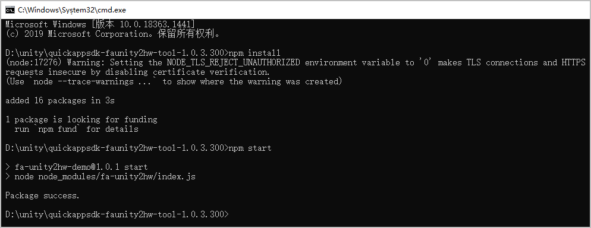

# 第三步：打包快游戏<a name="ZH-CN_TOPIC_0000001426058044"></a>
-   [方式一：使用快游戏开发者工具打包](#section1973035142715)
-   [方式二：使用快游戏打包工具打包](#section089016114271)
## 方式一：使用快游戏开发者工具打包<a name="section1973035142715"></a>
在快游戏开发者工具中导入WebGL项目文件夹，填写相关参数后即可快速转为快游戏，详细的转换流程可参见[Unity游戏转快游戏](https://developer.huawei.com/consumer/cn/doc/development/quickApp-Guides/quickgame-tool-unity-convert-0000001584762522)。
## 方式二：使用快游戏打包工具打包<a name="section089016114271"></a>
1.  分别解压adapter文件夹的**适配层代码**和tools文件夹的**快游戏打包工具**。
2.  将**适配层代码**的4个js脚本文件放至**快游戏打包工具**的**build**目录下。
3.  配置**build**目录下的manifest.json文件。
    <a name="table1139815129316"></a>
    <table><thead align="left"><tr id="row6491812153112"><th class="cellrowborder" valign="top" width="20%" id="mcps1.1.5.1.1"><p id="p12491312133112"><a name="p12491312133112"></a><a name="p12491312133112"></a>属性</p>
    </th>
    <th class="cellrowborder" valign="top" width="20%" id="mcps1.1.5.1.2"><p id="p11491101211318"><a name="p11491101211318"></a><a name="p11491101211318"></a>类型</p>
    </th>
    <th class="cellrowborder" valign="top" width="20%" id="mcps1.1.5.1.3"><p id="p64913126313"><a name="p64913126313"></a><a name="p64913126313"></a>必填(M)/选填(O)</p>
    </th>
    <th class="cellrowborder" valign="top" width="40%" id="mcps1.1.5.1.4"><p id="p24911112113118"><a name="p24911112113118"></a><a name="p24911112113118"></a>描述</p>
    </th>
    </tr>
    </thead>
    <tbody><tr id="row124911412123113"><td class="cellrowborder" valign="top" width="20%" headers="mcps1.1.5.1.1 "><p id="p94911412103115"><a name="p94911412103115"></a><a name="p94911412103115"></a>package</p>
    </td>
    <td class="cellrowborder" valign="top" width="20%" headers="mcps1.1.5.1.2 "><p id="p14914125312"><a name="p14914125312"></a><a name="p14914125312"></a>String</p>
    </td>
    <td class="cellrowborder" valign="top" width="20%" headers="mcps1.1.5.1.3 "><p id="p1549121213316"><a name="p1549121213316"></a><a name="p1549121213316"></a>M</p>
    </td>
    <td class="cellrowborder" valign="top" width="40%" headers="mcps1.1.5.1.4 "><p id="p14911512153119"><a name="p14911512153119"></a><a name="p14911512153119"></a>快游戏包名。请与创建快游戏时的应用包名保持一致。</p>
    </td>
    </tr>
    <tr id="row1349201233115"><td class="cellrowborder" valign="top" width="20%" headers="mcps1.1.5.1.1 "><p id="p6492131210316"><a name="p6492131210316"></a><a name="p6492131210316"></a>appType</p>
    </td>
    <td class="cellrowborder" valign="top" width="20%" headers="mcps1.1.5.1.2 "><p id="p134925127313"><a name="p134925127313"></a><a name="p134925127313"></a>String</p>
    </td>
    <td class="cellrowborder" valign="top" width="20%" headers="mcps1.1.5.1.3 "><p id="p15492112193112"><a name="p15492112193112"></a><a name="p15492112193112"></a>M</p>
    </td>
    <td class="cellrowborder" valign="top" width="40%" headers="mcps1.1.5.1.4 "><p id="p8492151213120"><a name="p8492151213120"></a><a name="p8492151213120"></a>游戏类型。请填写“fastgame”。</p>
    </td>
    </tr>
    <tr id="row1426410409318"><td class="cellrowborder" valign="top" width="20%" headers="mcps1.1.5.1.1 "><p id="p049251211319"><a name="p049251211319"></a><a name="p049251211319"></a>name</p>
    </td>
    <td class="cellrowborder" valign="top" width="20%" headers="mcps1.1.5.1.2 "><p id="p4492412153118"><a name="p4492412153118"></a><a name="p4492412153118"></a>String</p>
    </td>
    <td class="cellrowborder" valign="top" width="20%" headers="mcps1.1.5.1.3 "><p id="p124921412153111"><a name="p124921412153111"></a><a name="p124921412153111"></a>M</p>
    </td>
    <td class="cellrowborder" valign="top" width="40%" headers="mcps1.1.5.1.4 "><p id="p749281218318"><a name="p749281218318"></a><a name="p749281218318"></a>快游戏名称。请与创建快游戏时的应用名称保持一致。</p>
    </td>
    </tr>
    <tr id="row3914224328"><td class="cellrowborder" valign="top" width="20%" headers="mcps1.1.5.1.1 "><p id="p3492312183115"><a name="p3492312183115"></a><a name="p3492312183115"></a>versionName</p>
    </td>
    <td class="cellrowborder" valign="top" width="20%" headers="mcps1.1.5.1.2 "><p id="p17492161211319"><a name="p17492161211319"></a><a name="p17492161211319"></a>String</p>
    </td>
    <td class="cellrowborder" valign="top" width="20%" headers="mcps1.1.5.1.3 "><p id="p94921112183112"><a name="p94921112183112"></a><a name="p94921112183112"></a>O</p>
    </td>
    <td class="cellrowborder" valign="top" width="40%" headers="mcps1.1.5.1.4 "><p id="p4492171273112"><a name="p4492171273112"></a><a name="p4492171273112"></a>快游戏版本名称，例如1.0.0。</p>
    </td>
    </tr>
    <tr id="row5841853219"><td class="cellrowborder" valign="top" width="20%" headers="mcps1.1.5.1.1 "><p id="p3492012153115"><a name="p3492012153115"></a><a name="p3492012153115"></a>versionCode</p>
    </td>
    <td class="cellrowborder" valign="top" width="20%" headers="mcps1.1.5.1.2 "><p id="p849214125312"><a name="p849214125312"></a><a name="p849214125312"></a>Integer</p>
    </td>
    <td class="cellrowborder" valign="top" width="20%" headers="mcps1.1.5.1.3 "><p id="p1449281293115"><a name="p1449281293115"></a><a name="p1449281293115"></a>M</p>
    </td>
    <td class="cellrowborder" valign="top" width="40%" headers="mcps1.1.5.1.4 "><p id="p6492141243111"><a name="p6492141243111"></a><a name="p6492141243111"></a>快游戏版本号。从1开始，每次重新上传包时务必自增，否则将影响上架版本的更新。例如上次版本号为11，本次版本号应为12。</p>
    </td>
    </tr>
    <tr id="row94921512153115"><td class="cellrowborder" valign="top" width="20%" headers="mcps1.1.5.1.1 "><p id="p13492111213119"><a name="p13492111213119"></a><a name="p13492111213119"></a>icon</p>
    </td>
    <td class="cellrowborder" valign="top" width="20%" headers="mcps1.1.5.1.2 "><p id="p14492612133115"><a name="p14492612133115"></a><a name="p14492612133115"></a>String</p>
    </td>
    <td class="cellrowborder" valign="top" width="20%" headers="mcps1.1.5.1.3 "><p id="p17492151213316"><a name="p17492151213316"></a><a name="p17492151213316"></a>M</p>
    </td>
    <td class="cellrowborder" valign="top" width="40%" headers="mcps1.1.5.1.4 "><p id="p19492151218318"><a name="p19492151218318"></a><a name="p19492151218318"></a>快游戏图标所在的绝对路径。</p>
    </td>
    </tr>
    <tr id="row12492181273113"><td class="cellrowborder" valign="top" width="20%" headers="mcps1.1.5.1.1 "><p id="p949271214318"><a name="p949271214318"></a><a name="p949271214318"></a>minPlatformVersion</p>
    </td>
    <td class="cellrowborder" valign="top" width="20%" headers="mcps1.1.5.1.2 "><p id="p7493412173120"><a name="p7493412173120"></a><a name="p7493412173120"></a>Integer</p>
    </td>
    <td class="cellrowborder" valign="top" width="20%" headers="mcps1.1.5.1.3 "><p id="p164939129316"><a name="p164939129316"></a><a name="p164939129316"></a>M</p>
    </td>
    <td class="cellrowborder" valign="top" width="40%" headers="mcps1.1.5.1.4 "><p id="p1493161211318"><a name="p1493161211318"></a><a name="p1493161211318"></a>支持的最小平台版本号，原理同Android API Level，用于兼容性检查，避免上线后在低版本平台运行导致不兼容。游戏的最小平台版本号必须不小于<strong id="b15387124803312"><a name="b15387124803312"></a><a name="b15387124803312"></a>1103</strong>。</p>
    </td>
    </tr>
    <tr id="row24931512113117"><td class="cellrowborder" valign="top" width="20%" headers="mcps1.1.5.1.1 "><p id="p13493101263111"><a name="p13493101263111"></a><a name="p13493101263111"></a>config</p>
    </td>
    <td class="cellrowborder" valign="top" width="20%" headers="mcps1.1.5.1.2 "><p id="p1849311210318"><a name="p1849311210318"></a><a name="p1849311210318"></a>Object</p>
    </td>
    <td class="cellrowborder" valign="top" width="20%" headers="mcps1.1.5.1.3 "><p id="p1349314122312"><a name="p1349314122312"></a><a name="p1349314122312"></a>M</p>
    </td>
    <td class="cellrowborder" valign="top" width="40%" headers="mcps1.1.5.1.4 "><p id="p64937126311"><a name="p64937126311"></a><a name="p64937126311"></a>配置console日志级别。详情请参见<a href="#p83751751193312">config参数说明</a>。</p>
    <pre class="screen" id="screen2044816260719"><a name="screen2044816260719"></a><a name="screen2044816260719"></a> "config": {
            "logLevel": "log"
    }</pre>
    </td>
    </tr>
    <tr id="row1849351283118"><td class="cellrowborder" valign="top" width="20%" headers="mcps1.1.5.1.1 "><p id="p194935121314"><a name="p194935121314"></a><a name="p194935121314"></a>router</p>
    </td>
    <td class="cellrowborder" valign="top" width="20%" headers="mcps1.1.5.1.2 "><p id="p749311129317"><a name="p749311129317"></a><a name="p749311129317"></a>Object</p>
    </td>
    <td class="cellrowborder" valign="top" width="20%" headers="mcps1.1.5.1.3 "><p id="p9493121215311"><a name="p9493121215311"></a><a name="p9493121215311"></a>O</p>
    </td>
    <td class="cellrowborder" valign="top" width="40%" headers="mcps1.1.5.1.4 "><p id="p3493161243111"><a name="p3493161243111"></a><a name="p3493161243111"></a>路由信息，请配置为"router": { }。</p>
    </td>
    </tr>
    <tr id="row1649331273113"><td class="cellrowborder" valign="top" width="20%" headers="mcps1.1.5.1.1 "><p id="p1493201223115"><a name="p1493201223115"></a><a name="p1493201223115"></a>display</p>
    </td>
    <td class="cellrowborder" valign="top" width="20%" headers="mcps1.1.5.1.2 "><p id="p14493181263117"><a name="p14493181263117"></a><a name="p14493181263117"></a>Object</p>
    </td>
    <td class="cellrowborder" valign="top" width="20%" headers="mcps1.1.5.1.3 "><p id="p1349351211315"><a name="p1349351211315"></a><a name="p1349351211315"></a>O</p>
    </td>
    <td class="cellrowborder" valign="top" width="40%" headers="mcps1.1.5.1.4 "><p id="p15493101212312"><a name="p15493101212312"></a><a name="p15493101212312"></a>UI相关配置。详情请参见<a href="#p163440023414">display参数说明</a>。</p>
    <pre class="screen" id="screen2013123217515"><a name="screen2013123217515"></a><a name="screen2013123217515"></a> "display": {
            "orientation": "portrait",
            "fullScreen": true
    }</pre>
    </td>
    </tr>
    </tbody>
    </table>
    config参数说明
    <a name="table13633192263418"></a>
    <table><thead align="left"><tr id="row76334227340"><th class="cellrowborder" valign="top" width="25%" id="mcps1.1.4.1.1"><p id="p13234103210347"><a name="p13234103210347"></a><a name="p13234103210347"></a>属性</p>
    </th>
    <th class="cellrowborder" valign="top" width="25%" id="mcps1.1.4.1.2"><p id="p22341332113413"><a name="p22341332113413"></a><a name="p22341332113413"></a>类型</p>
    </th>
    <th class="cellrowborder" valign="top" width="50%" id="mcps1.1.4.1.3"><p id="p1423453253410"><a name="p1423453253410"></a><a name="p1423453253410"></a>描述</p>
    </th>
    </tr>
    </thead>
    <tbody><tr id="row663432219349"><td class="cellrowborder" valign="top" width="25%" headers="mcps1.1.4.1.1 "><p id="p13234932123413"><a name="p13234932123413"></a><a name="p13234932123413"></a>logLevel</p>
    </td>
    <td class="cellrowborder" valign="top" width="25%" headers="mcps1.1.4.1.2 "><p id="p323493218347"><a name="p323493218347"></a><a name="p323493218347"></a>String</p>
    </td>
    <td class="cellrowborder" valign="top" width="50%" headers="mcps1.1.4.1.3 "><p id="p48011828956"><a name="p48011828956"></a><a name="p48011828956"></a>打印日志等级：</p>
    <a name="ul13413341351"></a><a name="ul13413341351"></a><ul id="ul13413341351"><li>error：若出现error等级的日志，则打印。</li><li>warn：若出现warn及以上等级的日志，则打印。</li><li>info：若出出info及以上等级的日志，则打印。</li><li>log：若出现log及以上等级的日志，则打印。</li><li>debug：若出现debug及以上等级的日志，则打印。</li></ul>
    </td>
    </tr>
    </tbody>
    </table>
    display参数说明
    <a name="table659034363412"></a>
    <table><thead align="left"><tr id="row46141143123416"><th class="cellrowborder" valign="top" width="25%" id="mcps1.1.4.1.1"><p id="p261413439345"><a name="p261413439345"></a><a name="p261413439345"></a>属性</p>
    </th>
    <th class="cellrowborder" valign="top" width="25%" id="mcps1.1.4.1.2"><p id="p5614194320349"><a name="p5614194320349"></a><a name="p5614194320349"></a>类型</p>
    </th>
    <th class="cellrowborder" valign="top" width="50%" id="mcps1.1.4.1.3"><p id="p661404363411"><a name="p661404363411"></a><a name="p661404363411"></a>描述</p>
    </th>
    </tr>
    </thead>
    <tbody><tr id="row96151143153417"><td class="cellrowborder" valign="top" width="25%" headers="mcps1.1.4.1.1 "><p id="p1161554316346"><a name="p1161554316346"></a><a name="p1161554316346"></a>orientation</p>
    </td>
    <td class="cellrowborder" valign="top" width="25%" headers="mcps1.1.4.1.2 "><p id="p1061544373415"><a name="p1061544373415"></a><a name="p1061544373415"></a>String</p>
    </td>
    <td class="cellrowborder" valign="top" width="50%" headers="mcps1.1.4.1.3 "><p id="p1361524319349"><a name="p1361524319349"></a><a name="p1361524319349"></a>快游戏显示方式：</p>
    <a name="ul18615643183416"></a><a name="ul18615643183416"></a><ul id="ul18615643183416"><li>portrait：竖屏显示。默认为portrait。</li><li>landscape：横屏显示。</li></ul>
    </td>
    </tr>
    <tr id="row3358119279"><td class="cellrowborder" valign="top" width="25%" headers="mcps1.1.4.1.1 "><p id="p461519438347"><a name="p461519438347"></a><a name="p461519438347"></a>fullScreen</p>
    </td>
    <td class="cellrowborder" valign="top" width="25%" headers="mcps1.1.4.1.2 "><p id="p13615144353411"><a name="p13615144353411"></a><a name="p13615144353411"></a>Boolean</p>
    </td>
    <td class="cellrowborder" valign="top" width="50%" headers="mcps1.1.4.1.3 "><p id="p1125875361320"><a name="p1125875361320"></a><a name="p1125875361320"></a>是否全屏模式：</p>
    <a name="ul864647201419"></a><a name="ul864647201419"></a><ul id="ul864647201419"><li>true：全屏模式。全屏模式下状态栏会被覆盖。默认为true。</li><li>false：非全屏模式。</li></ul>
    </td>
    </tr>
    </tbody>
    </table>
4.  配置打包工具根目录下的config.json文件。
    <a name="table123095434212"></a>
    <table><thead align="left"><tr id="row203791546428"><th class="cellrowborder" valign="top" width="20%" id="mcps1.1.5.1.1"><p id="p1737984194220"><a name="p1737984194220"></a><a name="p1737984194220"></a>属性</p>
    </th>
    <th class="cellrowborder" valign="top" width="20%" id="mcps1.1.5.1.2"><p id="p43794404215"><a name="p43794404215"></a><a name="p43794404215"></a>类型</p>
    </th>
    <th class="cellrowborder" valign="top" width="20%" id="mcps1.1.5.1.3"><p id="p19873316438"><a name="p19873316438"></a><a name="p19873316438"></a>必选(M)/可选(O)</p>
    </th>
    <th class="cellrowborder" valign="top" width="40%" id="mcps1.1.5.1.4"><p id="p20379949421"><a name="p20379949421"></a><a name="p20379949421"></a>说明</p>
    </th>
    </tr>
    </thead>
    <tbody><tr id="row1137919413422"><td class="cellrowborder" valign="top" width="20%" headers="mcps1.1.5.1.1 "><p id="p3379941427"><a name="p3379941427"></a><a name="p3379941427"></a><span>unity_webgl_build_dir</span></p>
    </td>
    <td class="cellrowborder" valign="top" width="20%" headers="mcps1.1.5.1.2 "><p id="p1379341423"><a name="p1379341423"></a><a name="p1379341423"></a>String</p>
    </td>
    <td class="cellrowborder" valign="top" width="20%" headers="mcps1.1.5.1.3 "><p id="p19878318437"><a name="p19878318437"></a><a name="p19878318437"></a>M</p>
    </td>
    <td class="cellrowborder" valign="top" width="40%" headers="mcps1.1.5.1.4 "><p id="p123790414425"><a name="p123790414425"></a><a name="p123790414425"></a>WebGL项目的存放路径。不建议WebGL项目放至<strong id="b1946015611423"><a name="b1946015611423"></a><a name="b1946015611423"></a>快游戏打包工具</strong>的根目录下。</p>
    </td>
    </tr>
    <tr id="row237964194211"><td class="cellrowborder" valign="top" width="20%" headers="mcps1.1.5.1.1 "><p id="p1337904104217"><a name="p1337904104217"></a><a name="p1337904104217"></a><span>unity_ide_version</span></p>
    </td>
    <td class="cellrowborder" valign="top" width="20%" headers="mcps1.1.5.1.2 "><p id="p103798434213"><a name="p103798434213"></a><a name="p103798434213"></a>String</p>
    </td>
    <td class="cellrowborder" valign="top" width="20%" headers="mcps1.1.5.1.3 "><p id="p1887183164310"><a name="p1887183164310"></a><a name="p1887183164310"></a>M</p>
    </td>
    <td class="cellrowborder" valign="top" width="40%" headers="mcps1.1.5.1.4 "><p id="p938064104212"><a name="p938064104212"></a><a name="p938064104212"></a>Unity的版本号。</p>
    </td>
    </tr>
    <tr id="row338015411428"><td class="cellrowborder" valign="top" width="20%" headers="mcps1.1.5.1.1 "><p id="p938017474217"><a name="p938017474217"></a><a name="p938017474217"></a><span>unity_build_mode</span></p>
    </td>
    <td class="cellrowborder" valign="top" width="20%" headers="mcps1.1.5.1.2 "><p id="p1438016464210"><a name="p1438016464210"></a><a name="p1438016464210"></a><span>number</span></p>
    </td>
    <td class="cellrowborder" valign="top" width="20%" headers="mcps1.1.5.1.3 "><p id="p19877315436"><a name="p19877315436"></a><a name="p19877315436"></a>M</p>
    </td>
    <td class="cellrowborder" valign="top" width="40%" headers="mcps1.1.5.1.4 "><p id="p0598154217256"><a name="p0598154217256"></a><a name="p0598154217256"></a>从Unity发布为WebGL时，您是否勾选Development Build：</p>
    <a name="ul11617204412518"></a><a name="ul11617204412518"></a><ul id="ul11617204412518"><li>0：未勾选。</li><li>1：勾选。</li></ul>
    </td>
    </tr>
    <tr id="row738020454218"><td class="cellrowborder" valign="top" width="20%" headers="mcps1.1.5.1.1 "><p id="p33807444212"><a name="p33807444212"></a><a name="p33807444212"></a><span>output_name</span></p>
    </td>
    <td class="cellrowborder" valign="top" width="20%" headers="mcps1.1.5.1.2 "><p id="p163803413427"><a name="p163803413427"></a><a name="p163803413427"></a>String</p>
    </td>
    <td class="cellrowborder" valign="top" width="20%" headers="mcps1.1.5.1.3 "><p id="p98793134318"><a name="p98793134318"></a><a name="p98793134318"></a>O</p>
    </td>
    <td class="cellrowborder" valign="top" width="40%" headers="mcps1.1.5.1.4 "><p id="p163801844424"><a name="p163801844424"></a><a name="p163801844424"></a>快游戏名称，须和已创建的快游戏名称保持一致。默认为<strong id="b11478255182718"><a name="b11478255182718"></a><a name="b11478255182718"></a>output</strong>。</p>
    </td>
    </tr>
    <tr id="row43801484213"><td class="cellrowborder" valign="top" width="20%" headers="mcps1.1.5.1.1 "><p id="p738019484214"><a name="p738019484214"></a><a name="p738019484214"></a><span>icon_path</span></p>
    </td>
    <td class="cellrowborder" valign="top" width="20%" headers="mcps1.1.5.1.2 "><p id="p1538074174210"><a name="p1538074174210"></a><a name="p1538074174210"></a>String</p>
    </td>
    <td class="cellrowborder" valign="top" width="20%" headers="mcps1.1.5.1.3 "><p id="p987431104312"><a name="p987431104312"></a><a name="p987431104312"></a>O</p>
    </td>
    <td class="cellrowborder" valign="top" width="40%" headers="mcps1.1.5.1.4 "><p id="p13808434213"><a name="p13808434213"></a><a name="p13808434213"></a>快游戏图标所在的绝对路径。</p>
    </td>
    </tr>
    <tr id="row1838010494215"><td class="cellrowborder" valign="top" width="20%" headers="mcps1.1.5.1.1 "><p id="p1538017414420"><a name="p1538017414420"></a><a name="p1538017414420"></a><span>sign</span></p>
    </td>
    <td class="cellrowborder" valign="top" width="20%" headers="mcps1.1.5.1.2 "><p id="p193802474216"><a name="p193802474216"></a><a name="p193802474216"></a>String</p>
    </td>
    <td class="cellrowborder" valign="top" width="20%" headers="mcps1.1.5.1.3 "><p id="p5871831154314"><a name="p5871831154314"></a><a name="p5871831154314"></a>O</p>
    </td>
    <td class="cellrowborder" valign="top" width="40%" headers="mcps1.1.5.1.4 "><p id="p143805417424"><a name="p143805417424"></a><a name="p143805417424"></a>证书指纹所在的绝对路径。若此处缺省，您需要把存放certificate.pem和private.pem文件的sign文件夹放至打包工具的根目录下。</p>
    </td>
    </tr>
    <tr id="row203801641427"><td class="cellrowborder" valign="top" width="20%" headers="mcps1.1.5.1.1 "><p id="p738015411424"><a name="p738015411424"></a><a name="p738015411424"></a><span>addressable_asset_system_streaming_assets_url</span></p>
    </td>
    <td class="cellrowborder" valign="top" width="20%" headers="mcps1.1.5.1.2 "><p id="p63812042426"><a name="p63812042426"></a><a name="p63812042426"></a>String</p>
    </td>
    <td class="cellrowborder" valign="top" width="20%" headers="mcps1.1.5.1.3 "><p id="p38723174311"><a name="p38723174311"></a><a name="p38723174311"></a>O</p>
    </td>
    <td class="cellrowborder" valign="top" width="40%" headers="mcps1.1.5.1.4 "><p id="p238124114216"><a name="p238124114216"></a><a name="p238124114216"></a>使用Addressable Assets System进行资源加载时该参数不能为空，值为unity_webgl_build_dir/StreamingAssets对应的服务端URL，例如https://server/path。</p>
    </td>
    </tr>
    </tbody>
    </table>
    ```
    // 填写文件路径时，要把“\”全部转换成“//”
    {
      "unity_webgl_build_dir": "D://quickappsdk-faunity2hw-tool-1.0.3.300//web2020",
      "unity_ide_version": "2020.3",
      "unity_build_mode": 1,
      "output_name": "game",
      "icon_path": "",
      "sign": "E://sign",
      "addressable_asset_system_streaming_assets_url": ""
    }
    ```
5.  完成以上配置后，在打包工具的根目录下进入终端界面：
    1.  先输入如下命令行安装依赖文件。若依赖文件安装失败，可参考[如何处理依赖文件安装失败](FAQ.md#section144922623620)。
        ```
        npm install
        ```
    2.  再输入如下命令行构建快游戏RPK包体。成功打包的快游戏将存放在dist文件夹中。若最终RPK包体超过20MB，解决方案请参考[Unity转RPK快游戏包体过大](FAQ.md#section1812814107377)。
        ```
        npm start
        ```
    
