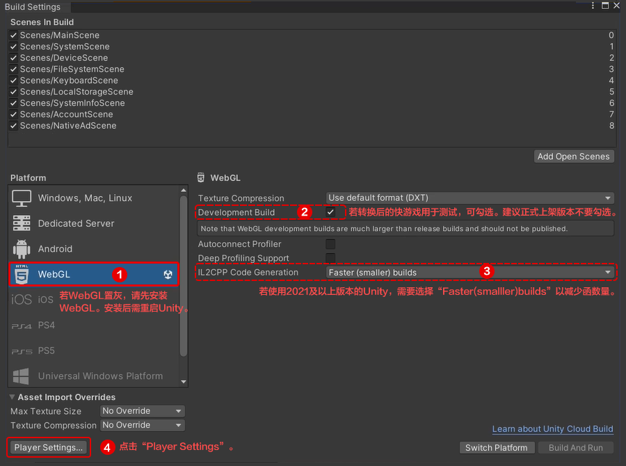
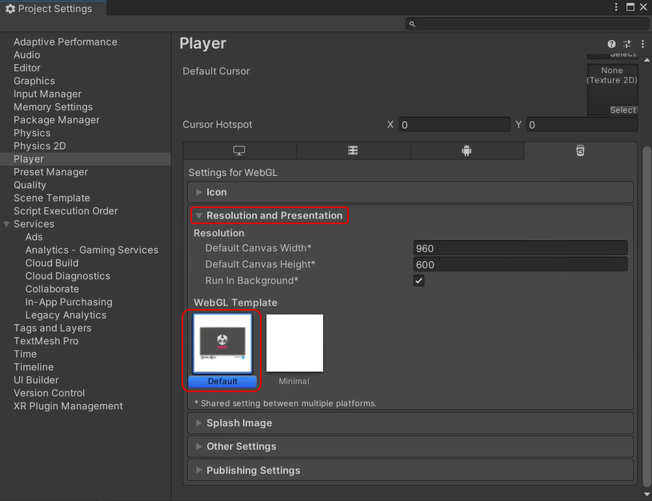
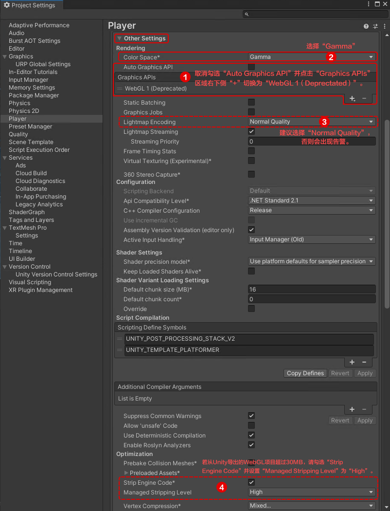
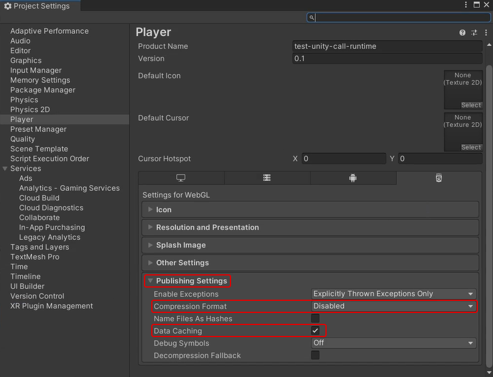

# 第二步：发布WebGL项目

1.  在Unity IDE的顶部菜单栏选择“File \> Build Settings”。
2.  在弹出的“Build Settings”窗口配置参数，完成后点击左下角“Player Settings”。请记住发布WebGL时**是否选择Development Build**。

    

3.  在弹出的“Project Settings”窗口中进行如下配置：
    -   在“Resolution and Presentation”区域下，“WebGL Template”选择“Default”。

        

    -   在“Other Settings”区域下配置参数：

        

    -   在“Publishing Settings”区域下，“Compression Format”选择“Disabled”，同时勾选“Data caching”。

        

4.  关闭“Project Settings”弹窗。
5.  确认Unity游戏的所有修改点均已保存后，点击“Build Settings”弹窗右下角“Build”开始构建并导出WebGL项目。若“Build”置灰，请先点击“Switch Platform”再构建WebGL项目。
6.  在本地找到生成的WebGL项目，将项目中不涉及代码的资源文件放至远程服务器，本地WebGL项目仅保留游戏的相关代码，这样可以缩小转换后的RPK包体大小。

